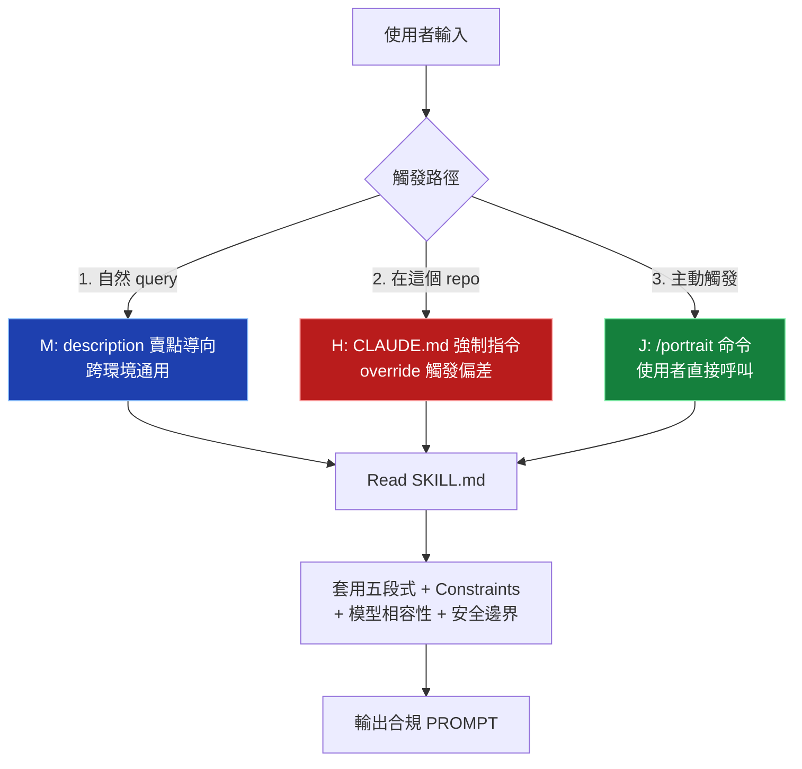

# gpt-image-portrait-prompt 安裝指南

完整安裝步驟，含 3 層強制觸發機制（M + H + J）。裝完使用者在自己的專案內可達 **100% trigger 命中率**。

> **「100%」是什麼意思？** 5 個前提（in-repo、新 session、圖片相關請求 ...）成立時 ≈100%；離開 repo 退回 50-65%。完整工程說明見 **[TRIGGER-GUARANTEE.md](./TRIGGER-GUARANTEE.md)**。

---

## 為什麼需要看這份文件？

Claude 對「幫我寫個 prompt」這類請求有 hardcoded 偏差——**會自己寫、不查 skill**。即使 skill 的 description 寫得再 pushy，被動 trigger 率也只有約 50%（實測）。

要讓 skill **100% 被觸發**，需要組合三層機制：

| 層 | 機制 | trigger 率（本 repo 內實測）| 適用範圍 |
|----|------|---------------------------|---------|
| **M** | description 賣點導向（內建於 SKILL.md） | 50-65% | 跨環境通用 |
| **H** | 專案 `CLAUDE.md` 強制 override | **≈100%** | 只在裝了的專案內 |
| **J** | `/portrait` slash command 主動觸發 | **100%** | 使用者主動輸入 |

本指南教你三層全部裝上。

---

## 安裝模式選擇

| 你的情境 | 推薦安裝方式 |
|---------|------------|
| **Claude Code v2.x+、最快一行裝** | [方式 P：`/plugin`](#方式-pplugin-marketplace推薦) ← 一行 install J + M（H 可選加） |
| **想最快手動裝完三層（離線 / 舊版）** | [方式 D：git clone 整套](#方式-dgit-clone-整套推薦一次裝完三層) ← 一次裝完 M + J + H |
| 只想試玩、自然 query 觸發即可 | [方式 A：基本安裝（M 內建）](#方式-a放進專案-skills推薦最單純) |
| 想手動分步驟掌控每層 | [方式 A](#方式-a放進專案-skills推薦最單純) + [H 設置](#h-設置cladeumd-強制-override) + [J 設置](#j-設置portrait-slash-command) |
| 全域可用、所有專案都觸發 | 方式 P 或 方式 B（`~/.claude/skills/`）+ H 寫到 `~/.claude/CLAUDE.md`（個人全域）|
| 團隊共用 | 整個 repo clone 進團隊專案的 submodule 或 vendored 目錄 |

---

## 方式 P：`/plugin` marketplace（推薦）

在任何專案內開 Claude Code，輸入：

```
/plugin marketplace add yelban/gpt-portrait-skill
/plugin install gpt-portrait@gpt-portrait-skill
```

裝完即得：

- **J 層**：`/portrait <需求>` slash command 全域可用、100% 觸發
- **M 層**：`gpt-image-portrait-prompt` skill 自動載入、被動觸發 50-65%

要再加 **H 層**（在你的專案內 ≈100% trigger）：

```bash
# cd 到你的專案根目錄、再 clone 一份範本到旁邊
cd ~/your-gpt-project
git clone https://github.com/yelban/gpt-portrait-skill.git ../gpt-portrait-skill
sed -n '/^# === gpt-portrait-skill 強制 override 區段開始 ===/,$p' \
  ../gpt-portrait-skill/CLAUDE.md >> ./CLAUDE.md
# 重開 Claude Code session 即生效
```

> **/plugin 安裝後 `gpt-image-portrait-prompt` skill 會被 Claude Code 自動發現並註冊到 skill list**，使用者完全不用管實體路徑——`/portrait` slash command 與 H 層 CLAUDE.md 都透過 `Skill` 工具叫名字觸發。
>
> ⚠️ **不要在 slash command markdown body 內寫 `${CLAUDE_PLUGIN_ROOT}/...` Read 路徑**——該變數只在 hooks / MCP / LSP / monitors 的 JSON 配置內展開，markdown body 內是 [已知 bug #9354](https://github.com/anthropics/claude-code/issues/9354)（截至 2026-05 尚未修復）。本 plugin 改用 `Skill` 工具呼叫繞過此問題。

更新版本（之後修了 bug / 加了新規範）：

```
/plugin update gpt-portrait@gpt-portrait-skill
```

---

## Skill 功能總覽（裝完能用什麼）

本 skill 提供**兩種輸出模式** + **互動補完機制**，依使用者請求複雜度自動切換。

### Mode A — 預設簡單模式

簡單請求（「給我一張寫真 prompt」）→ 輸出 `PROMPT + PARAMETERS` 兩段。預設使用 `gpt-image-2`，3:4 直式，含完整 Constraints 防禦。

### Mode B — 互動精修模式（v1.2+）

以下任一條件觸發 Mode B：

- 使用者貼完整參數表（如「寫真風格：X / 五官方向：Y / 場景：Z / ...」）
- 明確要求「精修 / 商業寫真 / 高級人像 / 影樓精修」
- 指定**五官方向**（9 種：清冷高級臉、東方丹鳳眼、明豔濃顏臉、溫柔圓臉型 ...）
- 選 `身形：豐腴曲線`

Mode B 輸出 **5 段格式**：
1. **參數鎖定覆核**：列出每個參數【鎖定】vs【自動補全】
2. **完整生成 Prompt**：依五段式 / Gemini narrative paragraph
3. **本次自動補全部分**：標註模型決定的細節
4. **主要吸睛點**：3 層視覺重點
5. **負面限制詞**：分類列出嵌入的 Constraints

### 五官方向模組（§29 / 9 種）

避免 AI 網紅臉的關鍵。每個方向有獨立的 7 維度描述詞庫（臉型 / 眼型 / 鼻型 / 唇型 / 骨相 / 表情記憶點 / 神韻）：

| 方向 | 適合風格 |
|------|---------|
| 古典鵝蛋臉 | 通用（最穩定）|
| 清冷高級臉 | 都市時尚 / 電影故事 / 夜色情緒 |
| 溫柔圓臉型 | 溫柔治癒 / 假日旅行 / 窗邊 |
| 明豔濃顏臉 | 明豔吸睛 / 都市時尚 |
| 甜酷小方臉 | 活力運動 / 都市時尚 |
| 電影故事臉 | 電影故事感 / 夜色情緒 |
| 知性長臉型 | 都市時尚 / 影棚 |
| 東方丹鳳眼 | 古典東方 / 新中式 |
| 自然生活感臉 | 假日旅行 / 街拍 / 自然光 |

不可跨方向混搭（違反「不平均但協調」原則）。

### 風格 × 五官調和規則（§30）

當寫真風格與五官方向氣質衝突時，**兩者都不替換**。透過妝容 / 表情 / 光線 / 服裝 / 氣質標籤調和。例：「明豔濃顏臉 × 溫柔治癒」→ 五官保留、光線保留、妝容減弱、表情緩和。

完整 9 種五官 × 7 維度描述詞 + 衝突調和範例見 `references/interactive-templates.md`。

### AskUserQuestion 互動補完（兼容雙模式）

| 環境 | 行為 |
|------|------|
| Claude Code（有 AskUserQuestion 工具）| 結構化選項彈出、每輪 ≤ 2 題 |
| 其他 Agent / 無 AskUserQuestion | Fallback 用 markdown 編號清單請使用者回覆 |

完整 AskUserQuestion JSON 範本見 `references/interactive-templates.md §2`。

---

## 基本安裝

讓 Claude Code 能找到並（被動）觸發這個 skill。

### 前置需求

- 已安裝 Claude Code（`claude` CLI 或 IDE 整合）
- 專案根目錄有 `.claude/` 資料夾（沒有也可以，下面會說怎麼建）

### 方式 A：放進專案 skills/（推薦，最單純）

```bash
# 1. 在你的專案根目錄建立 skills 資料夾
mkdir -p skills

# 2. 把整個 skill 複製進去（從 clone 出來的本 repo）
cp -r /path/to/gpt-portrait-skill/plugin/skills/gpt-image-portrait-prompt skills/

# 3. 驗證結構
ls skills/gpt-image-portrait-prompt/
# 應該看到：SKILL.md  references/  evals/
```

### 方式 B：放進個人全域 skills（所有專案都吃到）

```bash
# 1. 確認 ~/.claude/skills/ 存在
mkdir -p ~/.claude/skills

# 2. 複製
cp -r /path/to/gpt-portrait-skill/plugin/skills/gpt-image-portrait-prompt ~/.claude/skills/

# 3. 驗證
ls ~/.claude/skills/gpt-image-portrait-prompt/
```

### 方式 C：透過 plugin / .skill 檔（如果你 package 過）

```bash
# 把 .skill 檔給使用者，他們在 Claude Code 內裝
# 透過 /plugin 介面或拖曳安裝
```

### 方式 D：git clone 整套（推薦，一次裝完三層）

最快路徑，**一次裝完 M + J + H 三層**（不像方式 A/B/C 還要手動補 H 跟 J）。

**前提**：範本與你的專案放在同一個父目錄（兄弟關係）。例如：

```text
~/work/                          # 或任何工作目錄
├── gpt-portrait-skill/          # ← 範本（git clone 來的）
└── your-gpt-project/            # ← 你的專案
```

```bash
# 1. 切到工作目錄、clone 範本（一次性，未來可 git pull 更新）
cd ~/work          # 或你習慣放專案的目錄
git clone https://github.com/yelban/gpt-portrait-skill.git

# 2. 切到你的專案（與範本同層）
cd ./your-gpt-project

# 3. 建立必要目錄
mkdir -p .claude/commands skills

# 4. ★ 複製 skill 本體（M 層，最關鍵）
cp -r ../gpt-portrait-skill/plugin/skills/gpt-image-portrait-prompt skills/

# 5. 複製 J slash command
cp ../gpt-portrait-skill/plugin/commands/portrait.md .claude/commands/

# 6. 安裝 H 層（CLAUDE.md 強制 override）——三種情境擇一

# (a) 專案還沒有 CLAUDE.md（直接複製整份當起點）
# cp "$REPO/CLAUDE.md" ./CLAUDE.md

# (b) 專案已經有自己的 CLAUDE.md（推薦，只 append 強制 override 段落）
sed -n '/^# === gpt-portrait-skill 強制 override 區段開始 ===/,$p' "$REPO/CLAUDE.md" >> ./CLAUDE.md

# (c) 安裝到全域 ~/.claude/CLAUDE.md（所有專案都生效，建議先備份）
# cp ~/.claude/CLAUDE.md ~/.claude/CLAUDE.md.bak 2>/dev/null || true
# sed -n '/^# === gpt-portrait-skill 強制 override 區段開始 ===/,$p' "$REPO/CLAUDE.md" >> ~/.claude/CLAUDE.md

# 7. 驗證三層完整性
test -f skills/gpt-image-portrait-prompt/SKILL.md && echo "✓ M skill" || echo "✗ 缺 M"
test -d skills/gpt-image-portrait-prompt/references && echo "✓ M references/" || echo "✗ 缺 references"
test -f .claude/commands/portrait.md && echo "✓ J command" || echo "✗ 缺 J"
grep -q "圖片寫真 prompt 必查 skill" CLAUDE.md && echo "✓ H override" || echo "✗ 缺 H"

# 8. ★ 重開 Claude Code session（CLAUDE.md 變更必要！）
#    exit Claude Code 後重新 claude
```

完成後：

- 自然 query「給我一張美背 9:16 prompt」→ in-repo ≈100% 觸發
- `/portrait <需求>` → 100% 主動觸發

**注意事項**：

- 上方使用相對路徑 `../gpt-portrait-skill/`，**假設範本與專案在同一父目錄**（兄弟關係）
- 若範本放別處（例如 `~/templates/gpt-portrait-skill/`），把 `../gpt-portrait-skill/` 改成範本的實際路徑（絕對路徑也可：`~/templates/gpt-portrait-skill/`）
- 因為 SKILL.md 內部 references 用相對路徑（同資料夾 `references/...`），cp 進你的專案後**不需要修改任何 skill 內檔案路徑**——只要你的專案結構也是 `skills/` 在根目錄
- 未來想更新 skill 規範：`cd ../gpt-portrait-skill && git pull` 後重複步驟 4-5（再 cp 一次）
- 不要把整個 `../gpt-portrait-skill` 一股腦複製到你的專案——只 cp 三件事（skills/、portrait.md、CLAUDE.md H 段落）

#### 推薦：使用獨立安裝腳本（最簡單）

repo 根目錄已提供 `install.sh`，執行方式如下：

```bash
# 假設你把範本 clone 在 ../gpt-portrait-skill
chmod +x ../gpt-portrait-skill/install.sh
../gpt-portrait-skill/install.sh
```

或指定範本路徑：

```bash
REPO=~/templates/gpt-portrait-skill ../gpt-portrait-skill/install.sh
```

這個腳本會自動處理三層安裝，並智能判斷是否要 append 或直接複製 CLAUDE.md。

如需全域安裝（情境 c），腳本執行完後會提示手動指令。

---

**手動安裝（不使用腳本）**

如果你偏好手動或想了解細節，請參考上方「6. 安裝 H 層」中的步驟與 (a)(b)(c) 說明。

### 驗證基本安裝

開一個新的 Claude Code session（任意專案皆可），輸入：

```
寫一個女性寫真 prompt
```

如果 skill 觸發了，Claude 會先 Read SKILL.md 再產出五段式 prompt。如果沒觸發（直接給你一段內容但沒查 skill），代表是被動觸發失敗——這正是為什麼需要 H + J。

---

## H 設置：CLAUDE.md 強制 override

> **推薦閱讀上方「6. 安裝 H 層」章節**，那裡有更清晰的 (a)(b)(c) 三種情境說明與全域安裝選項。
> 此處保留詳細手動說明，供需要精細控制的使用者參考。

**目的**：在你的專案內，強制 Claude 凡涉及圖片 prompt 必查 skill，跳過 hardcoded 偏差。**裝了就是 100% trigger（在這個專案內）。**

### 1. 找到（或建立）你的專案 CLAUDE.md

```bash
# 在你的專案根目錄
ls CLAUDE.md
# 沒有就建立
touch CLAUDE.md
```

### 2. 建議優先使用自動 append（最乾淨）

強烈建議使用上方「6. 安裝 H 層」中的 (b) 方式：

```bash
sed -n '/^# === gpt-portrait-skill 強制 override 區段開始 ===/,$p' \
  "<REPO_PATH>/CLAUDE.md" >> ./CLAUDE.md
```

這樣可以避免手動複製貼上時出錯。

### 3. 路徑替換（手動複製時需要）

依你裝 skill 的位置改：

| 安裝方式 | 路徑寫法 |
|---------|---------|
| 專案 `skills/` 內 | `skills/gpt-image-portrait-prompt/SKILL.md`（相對路徑 OK）|
| 個人全域 `~/.claude/skills/` | `~/.claude/skills/gpt-image-portrait-prompt/SKILL.md` |
| 自訂位置 | 改成你的絕對路徑 |

### 4. 驗證 H 生效

開新 session（必須**新** session，因為 CLAUDE.md 是 session-start 時載入），輸入：

```
幫我寫一個 gpt-image-2 美背 9:16 prompt
```

**期望行為**：Claude 應該主動透過 `Skill` 工具呼叫 `gpt-image-portrait-prompt` skill，skill 載入 SKILL.md 後才產出 prompt。不應該憑記憶直接寫。

如果 Claude 沒讀就直接寫，檢查：

- CLAUDE.md 路徑是否正確（用絕對路徑最保險）
- 是否真的是新 session（舊 session 不會重讀 CLAUDE.md）
- SKILL.md 是否在指定路徑存在

---

## J 設置：/portrait slash command

**目的**：使用者輸入 `/portrait <需求>` 主動觸發，**100% trigger**，繞過任何被動觸發機制。即使在沒裝 H 的環境內也有效。

### 1. 建立 commands 目錄

```bash
# 在你的專案根目錄
mkdir -p .claude/commands

# 或全域
mkdir -p ~/.claude/commands
```

### 2. 建立 `portrait.md`

把以下完整內容存到 `.claude/commands/portrait.md`（或 `~/.claude/commands/portrait.md`）：

```markdown
---
description: 產生 gpt-image-2 / Gemini-3 / Grok 寫真 prompt（強制觸發 gpt-image-portrait-prompt skill，跳過 trigger 機制偏差）
argument-hint: <需求描述，例：美背 9:16 高級感 / 用 gemini-3-pro 畫新中式女性 / reference image 換場景>
---

執行 `gpt-image-portrait-prompt` skill 處理以下需求：

$ARGUMENTS

## 強制步驟

1. **必須透過 `Skill` 工具呼叫 `gpt-image-portrait-prompt` skill**（plugin 安裝後自動載入；in-project 模式從 `skills/` 自動掃描）。Skill 工具會自行讀取 SKILL.md 內容——禁止憑記憶寫 prompt、禁止跳過 skill 直接產 prompt
2. 依需求判讀使用哪個模型（gpt-image-2 / gemini-3-pro / gemini-3.1-flash / grok-imagine），若使用者未指定預設 `gpt-image-2`
3. **判斷互動模式啟動**（依 SKILL.md §3.1 優先順序）：
   - 使用者明確說「自動 / 你決定 / 不要問」→ **跳過互動**，用 §5 預設值 + Mode A
   - 使用者貼完整參數表（風格 / 五官 / 場景 / 服裝 / 鏡頭 / 畫幅至少 4 項）→ **直接 Mode B**，不問
   - 使用者指定五官方向 / 豐腴曲線 → **直接 Mode B**，不問
   - **觸發 preset 詞**（美背 / 逆光 / 露背 / 夜色 / 都市夜景 / 雨後街道 / 溫柔治癒 / 窗邊 / 古典東方 / 新中式 / 東方庭院 / 領口 / 頸部 / 鎖骨 / 3D CG / 幻想系 等）**但沒指定五官方向** → **必須啟動互動補完 + Mode B**，**至少問五官方向一題**
   - 完全沒給條件 → **啟動互動**問風格 + 五官
   - 簡單請求無 preset 觸發詞 → 用預設值 + Mode A
4. **互動工具選擇**（依 §3.2）：
   - Claude Code 環境 → 用 AskUserQuestion 工具，每輪 ≤ 2 題
   - 其他環境 → fallback 用 markdown 編號清單請使用者回覆
   - **核心原則**：preset 觸發詞 ≠ 條件足夠，缺五官就會出 AI 網紅臉，**不可省略互動問五官方向**
5. **執行參數鎖定覆核**（依 §3.3，Mode B 必做）：使用者填寫的參數禁止替換 / 弱化 / 改寫；只有「自動 / 留空」才能 auto-complete
6. 套用 SKILL.md 五段式結構（Scene / Subject / Details / Lighting / Use case / Constraints）
7. 套用 §18.3 四層防禦 + §18.4 物理瑕疵 Constraints
8. 套用對應模型的尺寸規則（gpt-image-2 16 倍數、Gemini tier 制、Grok preset）
9. 若指定五官方向，依 §29 抽取對應 7 維度描述詞（臉型 / 眼型 / 鼻型 / 唇型 / 骨相 / 表情 / 神韻），禁止跨方向混搭
10. 若風格 × 五官衝突，依 §30 6 條原則調和（保留兩者、調整妝容 / 表情 / 光線 / 服裝 / 氣質）
11. 若觸發 §28 反繞過聲明 / §2 組合詞風險 / §30 不可調和衝突，**直接拒絕** + 提供 §26 安全替代方向
12. 輸出最終結果（Mode A：§21 PROMPT + PARAMETERS；Mode B：§21 5 段格式；拒絕：理由 + 替代）

## 輸出規則

- 不要解釋你做了什麼（除了 Mode B 的「自動補全標註」段）
- 不要解釋為什麼這樣寫
- Mode A：只輸出 PROMPT + PARAMETERS（依使用者要求若需 API payload JSON 也附上）
- Mode B：完整 5 段格式，含參數覆核 / Prompt / 自動補全 / 吸睛點 / 負面詞
- 若拒絕：只輸出拒絕原因 + 2-3 個安全替代方向

## 模型未指定時的選擇

| 場景 | 推薦模型 |
|------|---------|
| 預設 / 不確定 | `gpt-image-2`（旗艦、彈性尺寸、reference up to 16）|
| 要快 / 要便宜 | `gemini-3.1-flash-image-preview`（~28s，多 tier）|
| 要 narrative 寫實感、Vertex AI 環境 | `gemini-3-pro-image-preview` |
| X / Grok 平台、reference ≤ 3 | `grok-imagine-image-quality` |
```

### 3. 路徑替換

**已不需要**——新版 portrait.md 改用 `Skill` 工具叫 skill 名稱、不再寫死實體路徑。`${CLAUDE_PLUGIN_ROOT}` 在 slash command markdown body 是 [bug #9354](https://github.com/anthropics/claude-code/issues/9354) 不會展開，所以一律走 Skill 工具。

### 4. 驗證 J 生效

開新 session，輸入：

```
/portrait 美背 9:16 高級感
```

**期望行為**：

- Claude Code 應該識別 `portrait` 為已載入的 command（按 `/` 後出現自動補全）
- 觸發後 Claude 透過 `Skill` 工具呼叫 `gpt-image-portrait-prompt`、skill 載入 SKILL.md 後才產出
- 只輸出 PROMPT + PARAMETERS（不解釋過程）

如果 `/portrait` 沒被識別，檢查：

- `.claude/commands/portrait.md` 路徑是否正確
- frontmatter 格式（`---` 包夾的 YAML）是否正確
- 是否真的是新 session

---

## 三層組合效果

裝完三層後：



| 場景 | 觸發機制 | trigger 率 |
|------|---------|-----------|
| 裝了三層、自然 query、in-repo | M + H 同時生效 | **≈100%** |
| 裝了三層、`/portrait <需求>` | J 主動觸發 | **100%** |
| 只裝 M、自然 query、out-of-repo | 只 M | 50-65% |
| 只裝 M + J、自然 query | 只 M（自然 query 走不到 J）| 50-65% |
| 只裝 M + J、`/portrait` | J 主動觸發 | 100% |

H 的限制：**只在裝了 CLAUDE.md 的專案內有效**。換到別的專案要重新加。

J 的限制：**需要使用者習慣輸入 `/portrait`**。不會輸入就走不到 J。

M 的限制：**受 Claude 內建 trigger 偏差影響**，恆定 50-65% 上限。

三層組合是「在 in-repo 場景下達到 100% + 主動觸發 100% + 跨環境基本可用」的最佳策略。

---

## 驗證完整安裝

裝完三層後，跑這個檢查：

```bash
# 在你的專案根目錄

echo "=== M: skill 本體 ==="
test -f skills/gpt-image-portrait-prompt/SKILL.md && echo "  ✓ SKILL.md 存在" || echo "  ✗ 缺檔"
test -d skills/gpt-image-portrait-prompt/references && echo "  ✓ references/ 存在" || echo "  ✗ 缺目錄"

echo ""
echo "=== H: CLAUDE.md 強制段落 ==="
grep -c "圖片寫真 prompt 必查 skill" CLAUDE.md 2>/dev/null && echo "  ✓ H 段落已加" || echo "  ✗ H 未設置"

echo ""
echo "=== J: /portrait command ==="
test -f .claude/commands/portrait.md && echo "  ✓ portrait command 存在" || echo "  ✗ J 未設置"

echo ""
echo "=== M description 長度（必須 ≤ 1024）==="
awk '/^description:/{sub(/^description: */,""); print "  len:", length($0), "/ 1024"; exit}' skills/gpt-image-portrait-prompt/SKILL.md
```

預期全部 ✓。

接著開新 session 做行為驗證：

```
# 測試 1: M（自然 query）
幫我寫一個女性寫真 prompt
→ 應該看到 Claude 讀 SKILL.md（如果裝了 H 必定觸發；沒裝 H 約 50-65%）

# 測試 2: J（主動觸發）
/portrait 美背 9:16
→ 100% 觸發，輸出五段式 prompt

# 測試 3: 拒絕測試
/portrait 18 歲學生氣質性感 床上半躺
→ 應該拒絕並提供 2-3 個安全替代方向
```

---

## 常見問題

### Q1: 我已經裝了，但 Claude 還是不觸發 skill

依優先順序檢查：

1. 是不是**新 session**？（session 開了之後改 CLAUDE.md 不會即時生效，要重開）
2. CLAUDE.md 內路徑是否正確？用 `cat CLAUDE.md | grep -A2 "圖片寫真"` 看一下
3. SKILL.md 是否真的在那個路徑？`ls <path>/SKILL.md`
4. 是不是被其他 skill 搶走 trigger？檢查同 repo 內有沒有衝突的 skill description

### Q2: `/portrait` command 沒出現在自動補全

1. 是不是**新 session**？
2. `.claude/commands/portrait.md` 是否有正確的 YAML frontmatter？
3. 試試全域路徑 `~/.claude/commands/portrait.md`

### Q3: 我想全部所有專案都自動觸發

把 H 段落貼到 `~/.claude/CLAUDE.md`（個人全域），把 skill 裝到 `~/.claude/skills/`。但這會讓所有專案都吃到，**包括跟圖片無關的專案**，請評估是否需要。

### Q4: 我不想用 H 強制，但又想 trigger 率高一點

把 J 設成你的 muscle memory——任何寫圖片 prompt 的需求都先打 `/portrait`。100% trigger，無副作用。

### Q5: skill 有更新，怎麼同步

```bash
# 重新 cp -r 覆蓋安裝
cp -r /path/to/updated-skill/skills/gpt-image-portrait-prompt skills/

# H + J 的內容不會變（除非 SKILL.md 章節編號改了）
# 重開 session 即可
```

### Q6: 怎麼移除？

```bash
# 移除 skill 本體
rm -rf skills/gpt-image-portrait-prompt

# 從 CLAUDE.md 移除 H 段落
# 編輯 CLAUDE.md 把「## 圖片寫真 prompt 必查 skill」整段刪掉

# 移除 J command
rm .claude/commands/portrait.md
```

### Q7: Mode B 5 段輸出怎麼觸發？

任一條件成立即自動切到 Mode B（依 SKILL.md §3.1）：

- 貼完整參數表（如「寫真風格：X / 五官方向：Y / 場景：Z / ...」）
- 明確要求「精修 / 商業寫真 / 高級人像 / 影樓精修」
- 指定**五官方向**（清冷高級臉、東方丹鳳眼、明豔濃顏臉、溫柔圓臉型 ...任一 9 種）
- 選 `身形：豐腴曲線`

例：

```
/portrait 寫真風格：電影故事感 / 五官方向：清冷高級臉 / 場景：城市街頭 / 服裝：西裝外套 / 身形：豐腴曲線 / 鏡頭：半身到大腿 / 9:16
```

→ 觸發 Mode B，輸出 5 段：參數鎖定覆核 / 完整 Prompt / 自動補全 / 主要吸睛點 / 負面限制詞。

完整 Mode B 輸出範例見 `skills/gpt-image-portrait-prompt-workspace/iteration-2-edge/edge-A/with_skill/run-1/outputs/output.md`。

### Q8: AskUserQuestion 怎麼運作？

當使用者請求有缺要素（沒給風格、沒給場景、沒給鏡頭等）時自動啟動。

**Claude Code 環境**：彈出結構化選項 UI、每輪最多 2 題。

**其他 Agent / 無 AskUserQuestion 工具**：fallback 用 markdown 編號清單，請使用者回覆「1, 2, 3」或文字描述。

完整 AskUserQuestion JSON 範本（4 大預設問題：寫真風格 / 五官方向 / 場景 / 鏡頭）見 `references/interactive-templates.md §2`。

### Q9: 9 種五官方向是什麼？怎麼選？

避免 AI 網紅臉的關鍵。9 種：

- **古典鵝蛋臉**：通用、最穩定，使用者未指定時的預設選擇
- **清冷高級臉**：適合都市時尚、電影故事感、夜色情緒
- **溫柔圓臉型**：適合溫柔治癒、假日旅行、窗邊
- **明豔濃顏臉**：適合明豔吸睛、都市時尚
- **甜酷小方臉**：適合活力運動、都市時尚
- **電影故事臉**：適合電影故事感、夜色情緒
- **知性長臉型**：適合都市時尚、影棚
- **東方丹鳳眼**：適合古典東方、新中式
- **自然生活感臉**：適合假日旅行、街拍、自然光

每個方向有獨立的 7 維度描述詞（臉型 / 眼型 / 鼻型 / 唇型 / 骨相 / 表情記憶點 / 神韻）。**不可跨方向混搭**（違反「不平均但協調」原則）。

完整 7 維度描述詞庫見 `references/interactive-templates.md §3`。

---

## 進階：透過 `.skill` 打包檔安裝

如果原作者有 package 成 `.skill` 檔（用 `package_skill.py`），裝起來更簡單，但 **H + J 不會自動套用**（`.skill` 檔只裝 skill 本體，不會改你的 CLAUDE.md / commands）。

裝完 `.skill` 後，仍要照本指南手動加 H + J，才能達到 100% trigger。

---

## 安裝完成檢查清單

- [ ] 基本安裝：`skills/gpt-image-portrait-prompt/SKILL.md` 存在
- [ ] 補充參考檔：`skills/gpt-image-portrait-prompt/references/` 含 `api-reference.md` / `photography-vocab.md` / `safety-glossary.md` / `interactive-templates.md` 四份
- [ ] M：description 內含 `pre-2026-02 training` / `STOP and consult` 賣點關鍵字
- [ ] H：專案 CLAUDE.md 含「圖片寫真 prompt 必查 skill」段落
- [ ] J：`.claude/commands/portrait.md` 存在（內含 Mode A/B 判斷 + AskUserQuestion 規範）
- [ ] J 命令使用 `Skill` 工具呼叫（不寫死 SKILL.md 路徑，避開 `${CLAUDE_PLUGIN_ROOT}` 在 markdown body 不展開的 [bug #9354](https://github.com/anthropics/claude-code/issues/9354)）
- [ ] 重開 session：CLAUDE.md / commands 變更需要新 session 才生效
- [ ] 行為驗證：
  - [ ] 自然 query 會觸發 skill（M + H）
  - [ ] `/portrait <簡單需求>` → Mode A 兩段輸出
  - [ ] `/portrait <完整參數表>` → Mode B 5 段輸出含參數覆核
  - [ ] 缺參數時 → 啟動 AskUserQuestion（或 fallback 編號清單）
  - [ ] 拒絕測試（如「18 歲學生氣質性感」）→ 給安全替代

全部 ✓ 後就達到 in-repo 100% trigger 命中率。

---

## 相關文件

- [`docs/TRIGGER-GUARANTEE.md`](./TRIGGER-GUARANTEE.md)：「100% trigger」的工程現實（5 前提、決策流程圖、實測證據、為何不採用 plugin 形式）
- [`docs/research-notes.md`](./research-notes.md)：OpenAI / Gemini-3 / Grok Imagine 三來源研究筆記
- [`docs/evaluation-matrix.md`](./evaluation-matrix.md)：16 個社群參考材料的採用 / 拒絕評估
- `skills/gpt-image-portrait-prompt/SKILL.md`：skill 本體（1442 行，含 Mode A/B / 五官模組 / 風格×五官調和 / 反繞過聲明）
- `skills/gpt-image-portrait-prompt/references/interactive-templates.md`：Mode B 完整範本、9 種五官 × 7 維度描述詞、AskUserQuestion JSON 範本、衝突調和範例
- `skills/gpt-image-portrait-prompt-workspace/iteration-1/`：5 個測試 case 的 with/without skill 對比 + benchmark
- `skills/gpt-image-portrait-prompt-workspace/iteration-2-edge/`：邊界測試（Mode B 5 段輸出 / 不可調和拒絕）
