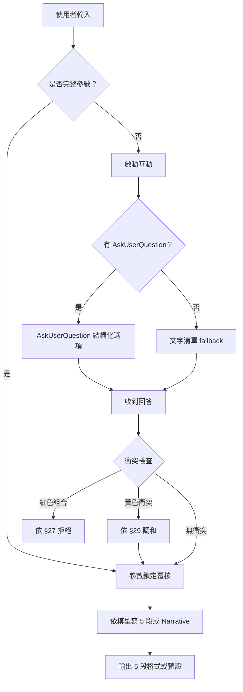

# 互動式參數模式 — 完整範本與規範

> SKILL.md §3 / §20 / §28 / §29 的延伸。需要詳細的 AskUserQuestion 結構、9 種五官方向描述詞、參數覆核範本、5 段輸出格式時翻這份。

本檔規範**互動式精修寫真模式**——當使用者需要更細緻的參數控制（如指定五官方向、要求參數鎖定、需要結構化選項）時使用。

---

## 1. 互動模式何時啟動

任何下列條件成立時，**自動進入互動模式**：

1. 使用者貼上完整參數表（如「寫真風格：X / 場景：Y / 五官：Z / ...」）
2. 使用者明確要求「精修」「商業寫真」「高級人像」
3. 使用者要求「不要 AI 網紅臉」「每張像新的人」
4. 使用者明確指定五官方向（如「清冷高級臉」「東方丹鳳眼」）
5. 使用者選 `身形：豐腴曲線`
6. 使用者要 5 段輸出格式（要參數覆核 / 自動補全標註）

否則使用 SKILL.md §20 預設的 PROMPT + PARAMETERS 簡單格式。

---

## 2. AskUserQuestion 規範（主路徑）

### 2.1 工具可用性判斷

| 環境 | 行為 |
|------|------|
| **Claude Code（有 AskUserQuestion）** | **預設使用** AskUserQuestion 呈現結構化選項 |
| 其他 Agent / API 直呼 | Fallback：用文字呈現選項清單，請使用者回覆 |
| 使用者已給完整參數 | 不問，直接覆核 + 輸出 |
| 使用者說「自動 / 你決定 / 直接生成」| 不問，用預設值 |

### 2.2 AskUserQuestion 預設 4 大問題

Claude Code 環境下，缺參數時依序問（最多 4 題，不要全部一次問）：

#### 問題 1：寫真風格

```json
{
  "question": "想要哪種寫真風格？",
  "header": "寫真風格",
  "multiSelect": false,
  "options": [
    {"label": "電影故事感（推薦）", "description": "low-key 光、敘事感、有故事的眼神、適合都市/夜景"},
    {"label": "溫柔治癒", "description": "soft window light、奶油色調、安靜氛圍、適合居家/窗邊"},
    {"label": "都市時尚", "description": "tailored 服裝、街頭背景、editorial 雜誌風"},
    {"label": "輕性感氛圍", "description": "克制、tasteful、refined feminine charm、不露不俗"}
  ]
}
```

如使用者問題已涵蓋風格（如「美背逆光」明顯指向 Backlit preset），跳過此題。

#### 問題 2：五官方向 + 氣質

```json
{
  "question": "想要怎樣的五官方向？（決定臉型、眼型、神韻記憶點）",
  "header": "五官方向",
  "multiSelect": false,
  "options": [
    {"label": "自動 / 你決定", "description": "依風格自動匹配，避免 AI 網紅臉"},
    {"label": "清冷高級臉", "description": "鵝蛋臉、細長眼、薄唇、冷感骨相、適合都市時尚 / 電影故事"},
    {"label": "溫柔圓臉型", "description": "圓潤輪廓、雙眼皮、柔軟唇形、適合溫柔治癒 / 居家"},
    {"label": "東方丹鳳眼", "description": "細長上揚丹鳳、薄唇、東方古典骨相、適合新中式 / 古典東方"}
  ]
}
```

需更多選項時，分批問或讓使用者打開「Other」。完整 9 種見 §3。

#### 問題 3：場景方向

```json
{
  "question": "拍攝場景？",
  "header": "場景方向",
  "multiSelect": false,
  "options": [
    {"label": "窗邊 / 高級室內", "description": "soft window light、editorial 雜誌感、適合溫柔/電影風"},
    {"label": "城市街頭 / 雨後街道", "description": "neon、wet pavement、cinematic、適合都市時尚/夜色情緒"},
    {"label": "東方庭院 / 木質空間", "description": "新中式、jade muted colors、bamboo shadow、適合古典東方"},
    {"label": "海邊 / 度假", "description": "resort 美學、自然光、適合假日旅行/活力運動"}
  ]
}
```

#### 問題 4：鏡頭 + 畫幅（合併）

```json
{
  "question": "鏡頭構圖 + 畫幅比例？",
  "header": "鏡頭 / 比例",
  "multiSelect": false,
  "options": [
    {"label": "半身到大腿 + 3:4（推薦）", "description": "editorial 標準、1152x1536、適合社群"},
    {"label": "全身 + 9:16", "description": "lookbook、1152x2048、適合 IG/手機"},
    {"label": "半身近景 + 1:1", "description": "雜誌封面感、1024x1024、適合大頭照變體"},
    {"label": "電影感近景 + 16:9", "description": "narrative、2048x1152、橫式適合桌布"}
  ]
}
```

### 2.3 多題策略

- **一次只問 1-2 題**：問完一輪等使用者回答再問下一輪。一次問 4 題太多。
- **優先順序**：寫真風格 > 五官方向 > 場景 > 鏡頭/畫幅
- **跳題規則**：使用者輸入已涵蓋的題目自動跳過

### 2.4 Fallback 文字版（非 Claude Code 環境）

當 AskUserQuestion 工具不可用時，用 markdown 清單呈現，請使用者回覆編號：

```
我需要 3 個關鍵參數才能產出最佳 prompt。請選擇（回覆 1-4 或寫具體需求）：

【寫真風格】
1. 電影故事感（推薦）— low-key 光、敘事感
2. 溫柔治癒 — soft window light、奶油色調
3. 都市時尚 — tailored、editorial 雜誌風
4. 輕性感氛圍 — 克制、tasteful

【五官方向】
1. 自動匹配風格（避免 AI 網紅臉）
2. 清冷高級臉 — 鵝蛋臉、細長眼、冷感骨相
3. 溫柔圓臉型 — 圓潤、雙眼皮、柔軟唇形
4. 東方丹鳳眼 — 細長上揚、東方古典骨相

【鏡頭 + 畫幅】
1. 半身到大腿 + 3:4（推薦）
2. 全身 + 9:16
3. 半身近景 + 1:1
4. 電影感近景 + 16:9

請回覆，例如：「1, 2, 1」或「電影故事感 / 清冷高級臉 / 9:16 全身」
```

---

## 3. 9 種五官方向完整描述詞庫

每種給：**臉型 / 眼型 / 鼻型 / 唇型 / 骨相 / 表情記憶點 / 神韻**。

寫 prompt 時，從五官方向所屬段抽詞置入 Subject 段，**禁止互混不同方向的元素**（不平均但協調）。

### 3.1 溫柔圓臉型

- **臉型**：soft round face, gentle jawline, rounded cheek
- **眼型**：almond eyes with a slight upward outer corner, gentle double eyelids
- **鼻型**：small softly rounded nose tip, low-key nose bridge
- **唇型**：cushioned soft lips, slight natural pout
- **骨相**：soft bone structure, no sharp angles
- **表情記憶點**：closed-mouth quiet smile, slight downturn relaxed eyes
- **神韻**：gentle, kind, warm — like morning light

適合：溫柔治癒、假日旅行、窗邊、咖啡館
不適合：清冷氣質、夜色情緒、明豔吸睛

### 3.2 清冷高級臉

- **臉型**：oval face, refined jawline, sculpted cheek
- **眼型**：long narrow eyes, flat double eyelids, cool gaze with subtle distance
- **鼻型**：straight refined nose bridge, defined nose tip
- **唇型**：thin refined lips, neutral expression
- **骨相**：clean angular bone structure, balanced asymmetry
- **表情記憶點**：composed quiet gaze away from camera, no smile, slight gravity
- **神韻**：cool, intellectual, untouchable — like winter window light

適合：都市時尚、電影故事感、夜色情緒、影棚
不適合：活力運動、甜美風

### 3.3 古典鵝蛋臉

- **臉型**：classic egg-shaped face, balanced proportions
- **眼型**：almond eyes with natural double eyelids, soft gaze
- **鼻型**：classic straight nose bridge, gently defined tip
- **唇型**：medium full lips with refined cupid's bow
- **骨相**：classical balanced bone structure
- **表情記憶點**：calm contained smile, attentive gaze
- **神韻**：elegant, timeless, refined — like classical portraiture

適合：所有風格通用（最穩定）

### 3.4 明豔濃顏臉

- **臉型**：vivid face with pronounced features
- **眼型**：large expressive eyes with deep double eyelids, vivid gaze
- **鼻型**：defined nose bridge with sculpted tip
- **唇型**：full lips with vivid color, defined cupid's bow
- **骨相**：strong bone structure, defined cheekbones
- **表情記憶點**：confident half-smile, direct or slight three-quarter eye contact
- **神韻**：vivid, magnetic, eye-catching — like editorial cover star

適合：明豔吸睛、都市時尚、夜色情緒
不適合：溫柔治癒、自然生活感

### 3.5 甜酷小方臉

- **臉型**：slight square jawline with soft fill, youthful contour
- **眼型**：round expressive eyes with crisp upper lash line
- **鼻型**：small refined nose with rounded tip
- **唇型**：medium lips with soft attitude
- **骨相**：youthful slightly square bone structure, soft tissue fill
- **表情記憶點**：subtle attitude, slight smirk or cool gaze
- **神韻**：sweet but cool, playful but composed — like K-pop / J-pop aesthetic

適合：活力運動、都市時尚、夜景街區
不適合：古典東方、溫柔治癒

### 3.6 電影故事臉

- **臉型**：cinematic face with subtle asymmetry, lived-in quality
- **眼型**：slightly downturned outer corners, eyes carrying weight
- **鼻型**：natural slightly irregular nose, real-person feel
- **唇型**：medium lips with subtle natural color
- **骨相**：bone structure with story — not perfect symmetry
- **表情記憶點**：introspective gaze, slight melancholy or quiet thought
- **神韻**：cinematic, narrative-rich, lived — like Wong Kar-wai protagonist

適合：電影故事感、夜色情緒、雨後街道
不適合：明豔吸睛、活力運動

### 3.7 知性長臉型

- **臉型**：elongated face with refined proportions
- **眼型**：almond eyes with refined eyelid line, intelligent gaze
- **鼻型**：long straight nose bridge with refined tip
- **唇型**：medium thin lips with subtle definition
- **骨相**：elongated refined bone structure
- **表情記憶點**：subtle attentive smile, eyes carrying intelligence
- **神韻**：intellectual, refined, professional — like editor-in-chief

適合：都市時尚、影棚、知性氣質
不適合：活力運動、甜美風

### 3.8 東方丹鳳眼

- **臉型**：classical East Asian face with refined jawline
- **眼型**：long slender phoenix eyes with upward outer corner, single or barely-visible double lid
- **鼻型**：refined classical nose bridge, softly defined tip
- **唇型**：medium lips with classical curve, slight natural color
- **骨相**：classical East Asian bone structure, refined
- **表情記憶點**：composed half-smile, knowing gaze, slight gravity
- **神韻**：classical East Asian elegance — like Tang dynasty portraiture, modernized

適合：古典東方、新中式、東方庭院
不適合：歐美 editorial 過強的風格

### 3.9 自然生活感臉

- **臉型**：natural everyday face, real-person quality, subtle imperfections
- **眼型**：natural eye shape with normal eyelid, relaxed gaze
- **鼻型**：natural nose with slight character (not over-sculpted)
- **唇型**：natural lips with everyday color
- **骨相**：natural bone structure with everyday variations
- **表情記憶點**：candid genuine smile or relaxed neutral, real moment
- **神韻**：approachable, real, lived — like documentary portrait, not posed

適合：假日旅行、咖啡館、街拍、自然光
不適合：影棚精修、明豔吸睛、夜色情緒

---

## 4. 參數鎖定 + 覆核範本

### 4.1 鎖定原則

**使用者明確填寫的參數必須嚴格執行，禁止：**
- 替換為其他選項
- 弱化為相近概念
- 改寫為「更適合」的版本
- 自動最佳化

**只允許：**
- 對已鎖定參數做擴寫和細化（如「白襯衫」可擴寫為「白色 oxford 棉質襯衫，袖口微捲」）
- 對「自動 / 留空」項目自動匹配

### 4.2 覆核步驟（在輸出 prompt **之前** 執行）

1. 列出使用者所有明確填寫的參數
2. 標註哪些是「鎖定」（使用者填了具體值）、哪些是「自動」（使用者填了「自動」或留空）
3. 確認 prompt 內容**全部鎖定值都有體現**且未被替換
4. 列出自動補全的項目（讓使用者知道哪些是模型決定的）

### 4.3 覆核覆核範本（5 段輸出格式 - Mode B）

```
## 1. 參數鎖定覆核

✓ 寫真風格【鎖定】：電影故事感
✓ 五官方向【鎖定】：清冷高級臉
✓ 場景方向【鎖定】：城市街頭
✓ 服裝方向【鎖定】：西裝外套
✓ 氣質標籤【自動補全】：故事感
✓ 身形方向【鎖定】：豐腴曲線
✓ 線條強調【鎖定】：中
✓ 鏡頭方向【自動補全】：半身到大腿
✓ 畫幅比例【鎖定】：9:16

## 2. 完整生成 Prompt

[完整英文 prompt，依五段式或 narrative paragraph 依模型]

## 3. 本次自動補全部分

- 氣質標籤：故事感（依電影故事感 + 清冷高級臉自動匹配，最契合「敘事重量 + 冷感骨相」的氣質）
- 鏡頭方向：半身到大腿（依西裝外套 + 9:16 自動匹配，能完整呈現西裝剪裁與身形比例）

## 4. 主要吸睛點

- 第一眼：冷感眼神 + 西裝挺立肩線
- 第二層：城市霓虹 rim light 勾勒輪廓
- 第三層：豐腴曲線在西裝剪裁下的優雅 S 線

## 5. 負面限制詞（已嵌入 Constraints）

- No childlike features, no teen styling, no body-part close-up
- No plastic skin, no over-smoothing, no AI artifacts
- No deformed hands, no extra fingers, no fabric warping
- No watermark, no logo, no extra text
```

---

## 5. 5 段輸出 vs 預設輸出選擇

| 場景 | 用哪種輸出 |
|------|----------|
| 簡單請求（「給我一張寫真 prompt」）| §20 預設 PROMPT + PARAMETERS |
| 使用者貼完整參數表 | **5 段格式（Mode B）** |
| 使用者要求「精修」「商業寫真」 | **5 段格式（Mode B）** |
| 使用者要 API payload | §20 預設 + API payload |
| 使用者要 reference image edit | §22 範例格式 + API payload |

---

## 6. 風格 × 五官調和規則（§29 延伸）

當寫真風格與五官方向有衝突時的詳細處理。

### 6.1 6 條核心原則（重申 §29）

1. **五官結構不變，調整妝容和表情**
2. **寫真風格不變，調整光線和服裝細節**
3. **氣質標籤作為中間調和器**
4. 不允許將指定五官方向改為更適合該風格的五官
5. 不允許將指定寫真風格改為更適合該五官的風格
6. 最終結果是「**該五官方向的人物，以該寫真風格被拍攝**」，不是反過來

### 6.2 衝突調和範例

#### 範例 A：「溫柔圓臉型 × 夜色情緒」

兩者氣質衝突（溫柔 vs 夜色酷）。處理：

- 保留：溫柔圓臉型（soft round face / cushioned lips / gentle gaze）
- 保留：夜色情緒（neon / wet pavement / cinematic / cool color grading）
- 調和：
  - 妝容加強：smoky eye makeup（強化夜色感）
  - 表情：closed-mouth contained smile → quiet contemplative gaze
  - 光線：warm neon on cool ambient（柔光中性過渡）
  - 服裝：dark tailored coat with soft silk inner（剪裁強 / 內襯柔）

結果：「一個圓臉柔和的女性在夜色街頭被拍攝」（不是把臉變冷、不是把場景變亮）

#### 範例 B：「明豔濃顏臉 × 溫柔治癒」

兩者衝突（明豔 vs 溫柔）。處理：

- 保留：明豔濃顏臉（vivid features / full lips / strong cheekbones）
- 保留：溫柔治癒（soft window light / warm cream tones / cozy interior）
- 調和：
  - 妝容減弱：clean makeup with soft blush（淡化明豔，保留五官本身結構）
  - 表情：confident half-smile → soft contained smile
  - 光線：強保留溫柔（warm diffused window light）
  - 服裝：軟針織淺色（soft knit in cream）

結果：「一個五官明豔的女性在溫柔窗光下被拍攝」（不是把臉變平凡、不是把光變硬）

#### 範例 C：「東方丹鳳眼 × 都市時尚」

兩者不直接衝突，但有時代感差異。處理：

- 保留：東方丹鳳眼（phoenix eyes / classical bone）
- 保留：都市時尚（tailored / street / editorial）
- 調和：
  - 妝容：minimal classical（不誇張現代妝）
  - 服裝：modernized cheongsam blazer / fitted knit dress with classical lines
  - 場景：city street with East Asian architectural elements
  - 光線：editorial soft light

結果：「一個東方丹鳳眼的現代女性在都市環境被拍攝」（時代橋接，不是把臉現代化、不是把都市古典化）

### 6.3 不可調和的衝突 → 拒絕

某些組合無論怎麼調和都會違反安全：

- 「自然生活感臉 + 性感氛圍 + 床上」→ 觸發組合詞風險，拒絕
- 「東方丹鳳眼 + 童顏 + 學生」→ 觸發年齡邊界，拒絕
- 「明豔濃顏臉 + 真實人物參考圖」→ 觸發名人冒名風險，拒絕

依 SKILL.md §27 反繞過聲明處理。

---

## 7. 完整互動式 prompt 產出流程（put it all together）



每一步都不可省略覆核步驟。

---

## 8. 互動模式預設值（使用者未指定時的安全選擇）

| 欄位 | 預設值 |
|------|--------|
| 寫真風格 | 電影故事感 |
| 五官方向 | 古典鵝蛋臉（最穩定通用）|
| 場景方向 | 窗邊 或 城市街頭（依風格） |
| 服裝方向 | 修身針織 / 連衣裙（保守）|
| 氣質標籤 | 鬆弛、自信、知性 |
| 身形方向 | 正常曲線（**互動模式內若使用者選豐腴則 hard-lock**）|
| 線條強調 | 中 |
| 鏡頭方向 | 半身到大腿 |
| 畫幅比例 | 3:4 |
| 畫面方向 | editorial 精修（介於商業寫真與高級人像之間）|
| 默認年齡 | 22-28 歲（明確成年但偏年輕，避免幼態）|

預設值與 SKILL.md §5 對齊，但增加「畫面方向」「默認年齡」兩項互動模式新欄位。

---

## 9. 常見坑

1. **AskUserQuestion 一次問 4 題**：太多，使用者會放棄。每輪最多 2 題
2. **沒做參數覆核就輸出**：使用者明明指定「白襯衫」結果 prompt 寫「絲質連衣裙」——直接打臉
3. **把 5 種五官元素混搭**：違反「不平均但協調」，產出 AI 網紅臉
4. **遇到衝突直接改使用者輸入**：違反參數鎖定原則
5. **5 段輸出格式忘了 §17.3 + §17.4 Constraints**：技術性防禦仍要嵌進去
6. **Mode B 5 段輸出時忘了寫 PARAMETERS**：API 還是要叫，記得放在最後或第 2 段內

---

完整流程也可以透過 `/portrait <需求>` slash command 觸發。
